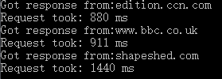
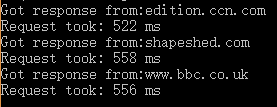

##第3章 Node.js的作用
>在本章中你将学到：
>* I/O的意义
>* Node.js想解决的问题
>* 并发的意义
>* 实现并发的不同方法

###3.1 设计Node.js的目的
在对运行Node.js程序的方法以及使用npm安装模块的方法能了简单的了解之后，本章要讲的是Node.js的设计目的。以下是Node.js网站提供的对Node.js的一段简短描述。
> Node.js是构建在Chrome的JavaScript运行时之上的一个平台，用于简单构建快速的，可扩展的网络应用程序。Node.js使用事件驱动的、非阻塞的I/O模型，这让其既轻量又高效，是运行于不同发布设力备上的数据密集型实时应用程序的完美平台。

对于一个普通的WEB开发人员而言，这里有很多让人混淆的术语！Node.js是GitHub上受围观最多的项目，在Web开发人员和更为新兴的商业领导者中赚足了眼球。这样的关注度导致的结果是会有大量的天花乱坠的宣传，虽然这是受欢迎的，但是也经常让人对Node.js是什么有误解。读者可能还听说过诸如“Node.js是新的Rails”或者"Node.js是WEB3.0"这样的说法。这两种说法都不对。Node.js不是像Rails或者Django那样的MVC框架，也不会每天早晨为你叠被子。在本章的末尾，读者将对Node.js是什么以及它的设计目的有一个更为清楚的理解。

##3.2 理解I/O

读者可能听说过与Node.js相关的术语“I/O”。I/O是输入/输出的简写，指的是计算机和人或者数据处理系统之间的通信。可以将I/O想成是数据在一次输入和一次输出之间的移动。以下是一些例子：
* 使用键盘敲入文本（输入）并在屏幕上看到文本显示（输出）
* 移动鼠标（输入）并在屏幕上看到鼠标移动（输出）
* 将数据传递给外壳脚本（shell script）（输入）并在终端上看到输出

##3.3 处理输入
在计算机程序里，经礼品卡需要来自用户的输入。这可以是命令行脚本提示符，也可以是表单、电子邮件或者文本信息等形式。计算机编程基本上就是编写解决某一个问题的软件并且处理围绕着该问题的可能的各种不可预测性。比如一个简单的请求用户输入如下信息的Web表单：
* 姓：
* 名：
* 电子邮件地址：

当用户提交表单的时候，数据将会保存到数据库中并显示在网页上。但是，也会有许多出错的可能，比如：
* 用户没有输入姓
* 用户没有输入入名
* 用户没有输入入电子邮件地址
* 用户输入的电子邮件地址不合法
* 用户输入入的文本太长，数据库无法保存
* 用户没有输入任何数据。

对于开发人员而言，识别这些场景并定义对这些场景的响应方法是家常便饭。这是重要的事情，因为这是软件稳定的要求；而且开发人员经常选择这样的场景编写自动化测试，以便测试他们的代码库，确保代码按期待中的方式工作。以下的示例来自名为Cucumber的测试架，这个框架可以让开发人员使用平实的英语编写测试：

```
Feature: Managing user
  In order to manage users
  As an administrator
  I want to be able to manage users on the system

Scenario: User does not enter a first name
    Given I am on the homepage
    When I press "Save"
    Then I should see "First name can't be blank"
```
这是软件开发的良好方法，因为将软件世界内的路线图标出来并且按照一分可预测的输入列表及其被接受的顺序来编写软件，是可行的。程序的响应方式可经过仔细编写，从而在所收到的输入的基础上发送正确的输出。在这个示例中，软件有一个输入：一个人将数据输入到表单。于是，识别场景、编写能够正确响应的代码以及编写用来编证代码的测试，都变得容易了。

当然计算机程序可以接受超过一个输入。比如，有个游戏控制台--就像任天堂的Wii或Xbox那样的。自己玩游戏是可能的，但与别人对打就更有趣！让我们假设你的朋友来了，而你正在Wii上玩Mario Kart。在这个游戏里，要选择角色然后在Go-Karts里围绕一条赛道跑。马上，关于数据输入的方法的许多可能场景就变的复杂得多。这里的输入可以被认为是两个Wii手柄，而输入则是一台电视机。不像上一个示例里的一名用户和一个表单，现在有许多事情需要考虑，比如：

* 两名游戏者
* 两个Wii手柄，每个各有8个数字按钮

由于游戏者可以任意方向在任何时间移动手柄并按8个按钮中的任何一个，有时候还组全上述动作，所以要想解决所有的可能发生的场景数量就是巨大的任务。要精确预测用户玩游戏的方式以及事情发生的顺序不容易。

有些游戏允许游戏者连接Internet并与其队游戏者在线游戏。在诸如Xbox上的Battlefield这样的游戏里，游戏者可以在Internet上通过语音和文本来沟通。软件面对的输入数量很快成了天文数字，比如：
* 可能会有上百万个游戏者
* 可能会有上百万个Xbox手柄
* 可能会有上百万个耳麦
* 游戏者在3D虚拟世界中随意移动

人类的不可预测性太过于优美，要想识别出每件可能发生的事情及其顺序就成了不可能的任务。读者可能还注意到，通过连接到Internet，更多人类输入都会被加入到软件中，而即便如此，还有其它一些输入和输出，比如：

* 负载平衡器
* 数据库服务器
* 语音服务器
* 消息服务器
* 游戏服务器

可能还有更多。更注意的是，对于这类软件来说要想识别各种场景及其顺序将是极为复杂的事情，因为这里有巨大的数量的，包括了人类和网络在内的各种变量。

在开发WEB软件时，从历史上看，开发人员能够可靠地预测输入和输出，这在编程风格上反映了出来。WEB最初是一种读取HTML文档的方法来设计的，HTML文档储存在服务器上，任何人只有有Internet连接就可以通过Web服务器来访问。

随着WEB越来越成熟，给基于WEB的软件加入数据库和脚本语言越来越普遍，这可在无需大量增加输入和输出的复杂性的情况下极大的增加了软件开发人员所能做的事情的可能性。预测输入如何被使用并且将场景数量映射到代码上相对容易。

今天，WEB应用程序的设计要复杂得多得多。I/O是碎片化的，而且更为频繁

* 与第三方应用程序编程接口（API）交互繁重
* 许多不同设备发关与接收数据，包括移动设备、电视和公告板。
* 巨大数量和客哀悼同时连接并实时交互。

##3.4 联网的I/O是不可预测的

在对I/O思想以及现代应用程序的复杂性有了更多的理解之后，重要的是要理解WEB应用程序人I/O是不可预测的，尤其在与时间有关的时候。为了演示这个问题，我们将运行一个小的Node.js程序来不同的WEB服务器获取主页。如果不能完全理解代码也不用担心，因为在第5章“HTTP”中将讲解它。
>程序清单3.1 演示网络I/O

```
var http = require('http'),
    urls = ['shapeshed.com','www.bbc.co.uk','edition.ccn.com'];

function fetchPage(url) {
  var start = new Date();
  http.get({host:url},function(res){
    console.log("Got response from:"+ url);
    console.log('Request took:',new Date()-start,'ms');
    })
}

for(var i=0; i<urls.length;i++){
  fetchPage(urls[i]);
}
```

在这个事例中，我们要求Node.js访问一个URL并报告响应的情况以及所耗费的时间。当程序运行时，输出会打印在终端上：



这里输入入的是来看成三个不同WEB服务器的响应，Node.js将输出发送到终端上。如可再次运行同样的代码，虽然我们会期望得到相同的结果，但看到的却是不同的输出：



如果读者自己运行这段代码，会看到响应的顺序改变了，或者至少响应的时间改变了。这是因为响应时间不是一成不变的。WEB服务器响应时间会随着如下这些因素中的某些元素的不同而变得极为不同。
* 解析DNS请求的时间
* 服务器的繁忙程序
* 要应答的数据有多大
* 服务器和客户的可用带宽
* 为响应而服务的软件的效率
* 所使用的网络的繁忙程序
* 数据要传输多远

##3.5 人类是不可预测的

如果读者为浏览器开发过JavaScript程序，就会理解在编写给人类用来与WEB页面交互的代码的时候，要使用不同的编程风格。要说出人类执行某一个动作的顺序或时间是不可能的。这里的一些JavaScript代码，用于在用户单击id为"target”的链接时显示提示：
```
var target = document.getElementByID("target");
target.onclick = function(){
  alert('Hey you clicked me!');
}
```
如果读者更熟悉jQuery，那么以jQuery写同样的代码就会是：
```
$('#target').click(function(){
  alert('Hey you clicked me!')
  })
```
 上述两个示例都在用户单击链接时在浏览器中显示提示信息。这些示例创建了对单击事件的侦听器（listener）并将基绑定到超语文本标记语言（HTML）或者文档对象模型（DOM）中的一个元素上。当用户单击链接时，该事件被触发，提示信息就会被显示，这段代码并不是对一组用户可能进行的动作按线性排序列出，然后以此构架代码：而是围绕事件来构架。事件可在任何时刻发生的话那么有个事件必须发生，即使我们并不知道事件什么时候会发生。

 JavaScript在浏览器中极高效地使用了这个模型，允许开发人员创建基于浏览器的富应用程序，这样的应用程序围绕着事件和用户与页面之间的交互方式编写。

##3.6 处理不可预测性

读者已经看到了，现在的WEB应用程序，和仅仅给浏览器提供HTML页面服务相比，要复杂得太多了。以下是现代WEB应用程序的一些趋势。

* 许多不同类型的设备可连接到WEB应用程序
* 设备可作为输入和输出
* 在一个应用程序内，不同的服务由不同的服务器来完成
* 应用程序与许多第三方数据源的交互很繁重
* 客户与服务器之间的数据实时双向流动

所有这些趋势都指向并发，这是计算机科学中著名的难题。并发这个术语的描述的是事性会在同时发生并可能互相交互。ql.io是Node.js用例的很好的例子，这是由eBay创建的给开发人员提供进入多个eBay数据源的单一接口服务。这个服务使得我们可以很容易地跨不同eBay组织请求数据。这个服务使用Node.js创建。其技术团队负责人Subbu Allamaruju提到，选择使用Node.js将他们从一些传统上与并发有关的问题解放出来。
>Node的事件化的I/O模型让我们无需担心互锁和并发这两个在多线程异步I/O中常见的问题

Node.js将JavaScript解决不确定性所用的事件驱动方法加入到解决并发编程的可能方法清单中。事件驱动编程并不是新的恩想。比如Python的Twisted和Ruby的Event Machine都是与Node.js相似的服务器技术。解决并发问题的其他方法还包括线程以及使用不同的进程。让Node.js与众不同的是，它给开发人员提供的用于处理并发的语言是JavaScript。JavaScript是一种事件驱动的语言，旨在能够在外界的事件作出响应。虽然我们绝对可以使用Ruby或Python骗过你出事件驱动的代码，但如果使用事件方式是解决并发问题最好的方法，那么考虑使用一种围绕着事件来设计的语言，至少是值得的。
